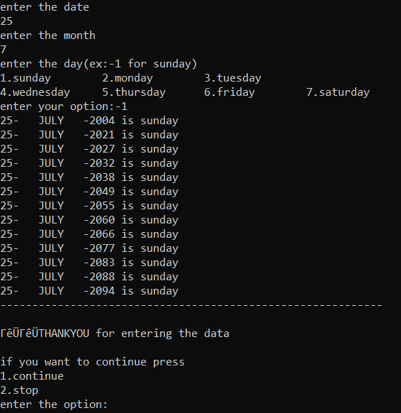
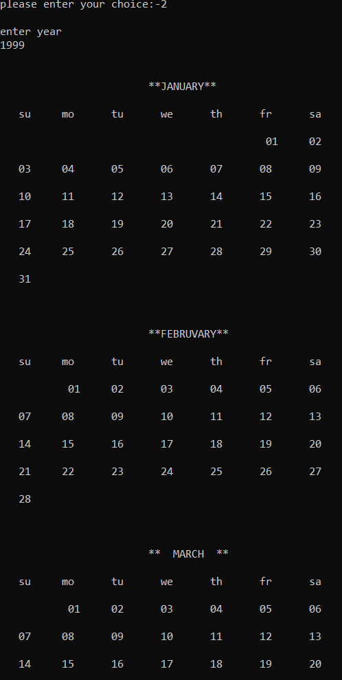
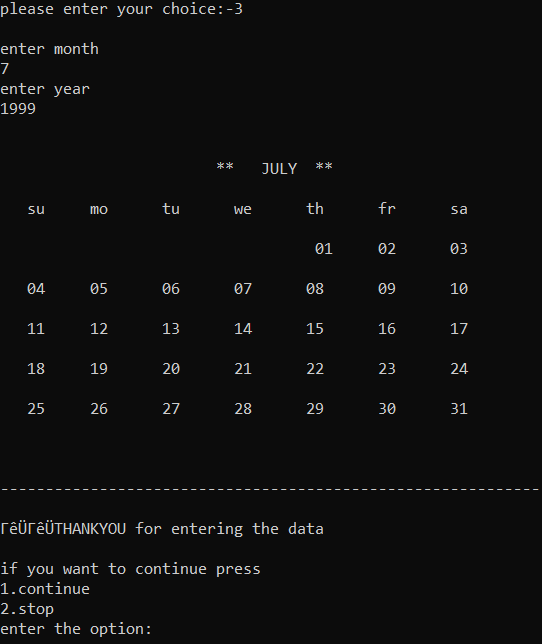
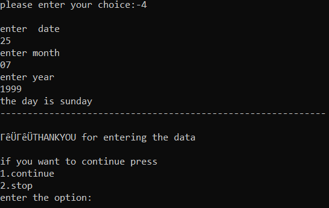

# Calendar Program for C
A User Friendly C Program For Calendar with attractive UI.
## Options Provided
    1) Years having same day and date
    2) Calendar of Given Year
    3) Calendar of Given Month
    4) To know the day of the date
## Example Sample Images
    1) Years having same day and date

    2) Calendar of Given Year 
        (Screenshot is too big,so first three months have only provided)
    

    3) Calendar of Given Month

    4) To know the day of the date

